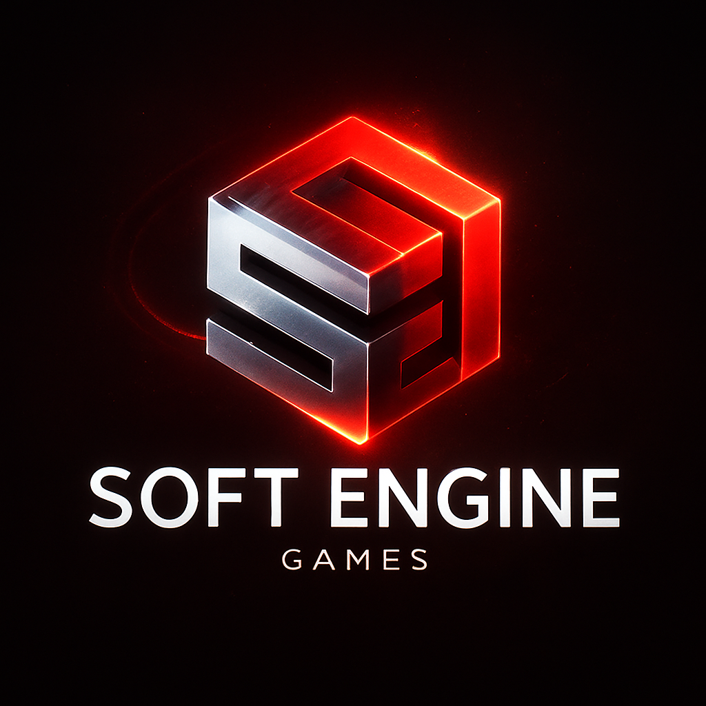

<!DOCTYPE html>
<html lang="en">
<head>
  <meta charset="UTF-8" />
  <meta name="viewport" content="width=device-width, initial-scale=1.0" />
  <title>Soft Engine Games</title>
  
</head>
<body>

  <header>
    

      
    

    <nav>
      <a href="#">Home</a>
      <a href="#">About</a>
      <a href="#">Browse Games</a>
      <a href="#">Privacy</a>
    </nav>
  </header>

  

    <h1>ON METAQUEST VR</h1>
    

      Soft Engine Games brings unique VR experiences to the MetaQuest Store. 
      Dive into our action-packed worlds and join the fun today!
    

    

      <a href="#">Play Free on Meta</a>
      <a href="#">Learn More</a>
      <a href="#">Privacy Policy</a>
    

    
On MetaQuest Store

    

      Updates, guns, monsters, and a hell ton of fun.
    

  

  

    © 2025 SoftEngineGames
  

</body>
</html>
